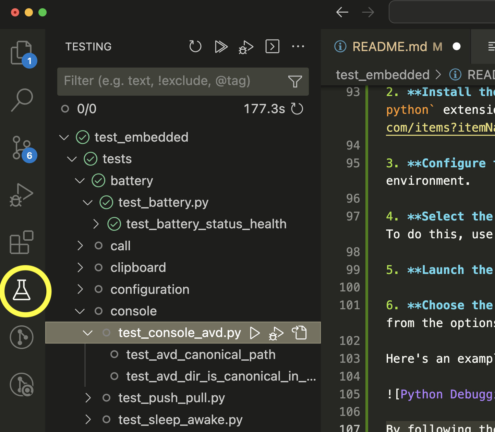

# Emulator End-to-End Testing

This document describes the  integration tests designed to thoroughly assess the emulator's performance under various conditions.

**Test Framework**: We employ the pytest framework for creating and executing these integration tests, seamlessly integrating them into our automated build process.

**Test Launcher**: To initiate these tests, we utilize the `run_tests.py` script, which undertakes the following tasks:

1. **Temporary Environment**: It sets up a temporary directory and establishes a virtual environment to isolate the testing environment from the main system.

2. **Dependency Installation**: Within this virtual environment, all necessary dependencies are installed to ensure the emulator and its components function correctly.

3. **Environment Configuration**: The script configures the `ANDROID_SDK_ROOT` environment variable to point to the relevant location within the current repository, specifically at `$AOSP_ROOT/prebuilts/android-emulator-build/system-images/OS_NAME`, that contains all system images that can be tested.

4. **Test Definitions**: For orchestrating the tests, the script loads test definitions from the [cfg/emulator_tests.json](cfg/emulator_tests.json) file.

5. **Test Execution**: Lastly, the script leverages pytest to execute all the tests defined within the test configuration, providing thorough coverage of emulator functionality.

These end-to-end tests play a pivotal role in ensuring the emulator's reliability and robustness, allowing us to maintain the expected behavior across a wide range of configurations.

## Running the tests on your local machine

To execute the tests on your local machine, follow these steps based on your operating system:

### On Posix (Linux/macOS):

You can run the tests using the `run_tests.sh` script. Additionally, you will need to provide the path to the emulator binary using the `-e` flag.

```bash
./run_tests.sh -e ~/src/emu-master-dev/external/qemu/objs/emulator
```

If you have a local build, you can enable symbol usage from the build:

```bash
./run_tests.sh -e ~/src/emu-master-dev/external/qemu/objs/emulator --symbols ~/src/emu-master-dev/external/qemu/objs/build/symbols
```

### On Windows:

To execute the tests on your Windows machine, use the `run_tests.cmd` script. You will also need to provide the path to the emulator binary using the `-e` flag.

```cmd
run_tests.cmd -e C:\src\emu\external\qemu\objs\emulator.exe
```

If you have a local build, you can enable symbol usage from the build directory:

```cmd
run_tests.cmd -e C:\src\emu\external\qemu\objs\emulator.exe --symbols C:\src\emu\external\qemu\objs\build\symbols
```

## Test configuration file

The test configuration file is a json file that describes which set of
tests to run under a given configuration. It has the following format:

```json
{
  "test_suite_1" : xxx,
  "test_suite_2" : xxx,
}
```

Where xxx descibes a test as follows:

```json
 "landscape_test_suite": {
       // This contains a human readable description of what this suite should do
        "description": "Set of tests that verify that graphic related tests work well in a `landscape` emulator",
        // Set of flags to pass to the emulator when it gets launched.
        // If this case if the tests require an emulator to be
        // launched it will add the `-qt-hide-window` flag.
        "launch_flags": ["-qt-window"],
        // Set of flags to pass to the pytest launcher. These
        // parameters are directly appended to the the pytest
        // invocation.
        // For example in this case we add `-m graphics`
        // parameter.
        "pytest_flags": [
            "-m graphics"
        ],
        // The avd configuration that will be used when running these tests.
        // These parameters are appended to the config.ini file of the
        // avd that will be created. This allows you to define your own custom
        // avd. The example below results in the creation of configuration
        // that uses api 33.
        //
        // Note that "abi.type" will be auto derived at the moment,
        "avd_config": {
            "api": "33",
            "tag.id": "google_apis",
            "hw.initialOrientation": "landscape",
            "skin.name" : "1280x720"
        }
    },
```

You can select the suite to test by passing in the `--test_suite` flag to the run_tests script:

```sh
run_tests.sh -e ~/src/emu-master-dev/external/qemu/objs/emulator --test_suite landscape_test_suite
```

## Development

To set up your development environment, follow these steps:

1. **Create a Virtual Environment**: Execute the following command to establish a virtual environment and install all the necessary dependencies required for running the tests:

```sh
. ./configure.sh
```

2. **Running Specific Tests:** If you want to run a specific subset of tests with an already active emulator, follow these instructions:

    - Ensure that you have launched the emulator with an Android Virtual Device (AVD) configuration that you intend to use for the tests.

    - Employ the following command to execute a particular test by specifying its name:
          pytest --debug_emulator -k "name_of_the_test"

    Replace `name_of_the_test` with the actual name of the test you wish to run.

### Running tests from Visual Studio Code

Visual Studio Code offers helpful extensions for [debugging](https://code.visualstudio.com/docs/python/testing) tests. Follow these steps to debug the e2e tests in Visual Studio Code:

1. **Open the Workspace**: Start by opening the Visual Studio Code [workspace](test_embedded.code-workspace).

2. **Install the Pylance Extension**: You will likely receive a recommendation to install the `ms-python.python` extension. You can install it from the [extension marketplace](https://marketplace.visualstudio.com/items?itemName=ms-python.python).

3. **Configure the Virtual Environment**: Run the `./configure.sh` script to configure the virtual environment.

4. **Select the Python Interpreter**: Choose the virtual environment as the Python Interpreter in VSCode. To do this, use the "Python: Select Interpreter" command and select `.venv/bin/python` from the test_embedded workspace.

5. **Launch the Emulator**: Manually start the emulator with the AVD configuration you want to test. The emulator can be launched from the command line, or from another visual studio code session.

6. **Choose the Test**: Select the specific test you wish to run. You can either debug or run the test from the options available under the flask icon.

Here's an example image for reference:



By following these steps, you can easily debug and run tests in Visual Studio Code. Note that not all the tests can succeed when ran from within visual studio. For example tests that need to restart the emulator will fail as we do not have
the ability to restart running emulators.

### Running tests with your local python interpreter

By default the test runner scripts are using the AOSP Python interpreter, which comes with some limitations, such as the absence of symbols and TLS support. The most troublesome limitation is that you will not be able to install additional packages, or use packages that rely on public symbols, such as [py-spy](https://github.com/benfred/py-spy). To work around this
you can install your own matching interpreter:

* Install [PyEnv](https://github.com/pyenv/pyenv) (`brew install pyenv`).
* Install Python 3.10.6 (`pyenv install 3.10.6`)
* Create a new virtual environment (`python -m venv .venv`)
* Activate the virtual environment (`source .venv/bin/activate`)
* Run run_tests.sh with the `--no-aosp` flag and the path to the emulator binary

For example:

    run_tests.sh -e ~/src/emu-master-dev/external/qemu/objs/emulator --symbols ~/src/emu-master-dev/external/qemu/objs/build/symbols --no-aosp

Now you can use your own python tools to inspect issues.

### Manually running tests from a suite

If you wish to run a test from a suite you will have to pass in the right parameters. You can find the exact details in the [cfg/emulator_tests.json](cfg/emulator_tests.json) file. For example to run the landscape test suite from the command line can run:

      pytest -m graphics and not multidisplay \
           --timeout=300 \
           --emulator=~/src/emu/external/qemu/objs/emulator \
           --avd_config '{
            "api": "33",
            "tag.id": "google_apis",
            "hw.initialOrientation": "landscape",
            "skin.name": "1280x720"
          }'  \
          --emulator_launch_flags '["-no-snapshot]'

## Obtaining new packages with devpi

The virtual environment is using the python interpreter in AOSP. This interpreter does not support TLS, and hence you will not be able to install external packages. To work around this you can run a local devpi server using a python interpreter that does support tls.

Devpi can be run by running a devpi server that is found here: [../../devpi/](../../devpi).

  + Change to the `../../devpi` directory.
  + Run the `./launch_devpi.sh` script.

ie:

    cd ../../devpi
    ./launch_devpi.sh

Once the devpi server is running, you can install packages from the devpi repository by running the following command:

    pip install <package_name>

For example, to install the py-spy package, you would run the following command:

    pip install py-spy

### Making new packages available for tests

If you are adding new packages you must make them available in our on disk repository. This means you will have to install the dependencies in our local repo. See [../../devpi/README. MD](../../devpi/README. MD) for more information on how to add new python packages to our local repository.

## I would like to add some tests

You can add test according to the [pytest](https://docs.pytest.org/en/stable/) framework. The test session will make an emulator object available for you. That is accessible through the `avd` fixture. This is an [Emulator](emu/emulator.py) object, which has some convenience methods to interact with the running emulator.

You can add your tests in a new .py file that automatically will be discovered. See the [boottest](tests/test_boot.py) example below:

```python
import pytest
from google.protobuf import empty_pb2

@pytest.mark.e2e
def test_booted(emulator_controller):
    """Make sure the emulator status is set to booted."""
    response = emulator_controller.getStatus(empty_pb2.Empty())
    assert response.booted
```

Make sure to start every test that you want to run with the `test_` prefix, otherwise it will not be discovered by pytest.

### Test Fixtures

Pytest encourages you to use [test fixtures](https://docs.pytest.org/en/6.2.x/fixture.html). We have a set of test fixtures defined in [tests/conftest.py](tests/conftest.py) that can be used to interact with the emulator. Here is a short list of fixtures:

* avd: Gives access to the emulator running the default avd.
* telnet: Gives access to the telnet console of the current emulator.
* adb: Function that invokes the adb executable with the given parameters.
* at_home: Rotate the emulator to portrait mode and move to the home screen.
* emulator_log: Access to the emulator logs.
* animation_app: Activates the animation app that displays a rotating triangle.
* emulator_controller: A grpc stub to the emulator controller.

### Test markers

Pytest allows you to define [markers](https://docs.pytest.org/en/7.1.x/example/markers.html). This allows you to mark a test with custom metadata which can be used to filter tests.

We have the following set of markers that can be used to annotate the various
tests.

  + adb: marks test as adb test.
  + boot: marks tests as boot test, these tests validate that something hold just after booting. (deselect with '-m "not boot"')
  + console: mark tests related to the emulator console
  + darwin: marks test as darwin only, will only run if you are on darwin.
  + e2e: marks test as end to end (deselect with '-m "not e2e"')
  + embedded: marks test as embedded only, will run on an embedded emulator.
  + foldable: marks test that operates on a foldable emulator
  + graphics: marks tests related to graphics operations
  + hardware: marks test as a low-level hardware test
  + linux: marks test as linux only, will only run if you are on linux.
  + perf: marks test as a performance test (deselect with '-m "not perf"')
  + resizable: marks test that should run on a resizable emulator
  + slow: marks tests as slow (deselect with '-m "not slow"')
  + snapshot: marks tests related to snapshot operations
  + multidisplay: mark tests related to multidisplay
  + win32: marks test as windows only, will only run on a windows machine.

For example the test below will only run on linux:

```python
  @pytest.mark.linux
  def test_linux_only():
      assert sys.platform == 'linux'
  ```

You can find all the markers, and the description, in the [pytest.ini](pytest.ini) file.

### Dealing with flaky tests and timeouts

E2E tests are sometimes flaky. In order to combat the flakiness we make use of the [pytest-rerunfailures](https://github.com/pytest-dev/pytest-rerunfailures) plugin. This plugin allows you to mark individual tests as flaky, and have them automatically re-run when they fail, add the flaky mark with the maximum number of times you'd like the test to run and re-run delay time in the marker:

```python
  @pytest.mark.flaky(reruns=5, reruns_delay=2)
  def test_example():
      import random
          assert random.choice([True, False])
  ```

For timeouts we make use of the [pytest-timeout](https://pypi.org/project/pytest-timeout/) plugin. This plugin will time each test and terminate it when it takes too long.

```python
  @pytest.mark.timeout(timeout=1, func_only=True)
  def test_timeout():
      sleep(20)
  ```

## Known Issuess

Here's a list of known issues and workarounds. Most of these are related to Mac M1.

## Missing wheels

If you are using an architecture that is not supported you might find that
packages are missing. You must check in these packages in our local (on disk)
repository. See [README. MD](../../devpi/README. MD) for details on how to do this.

### Java exceptions on Pytest log

If you see exceptions like the following when running pytest:

```java
Exception in thread "main" java.lang.NoClassDefFoundError: javax/xml/bind/annotation/XmlSchema
  at com.android.repository.api.SchemaModule$SchemaModuleVersion.<init>(SchemaModule.java:156)
  at com.android.repository.api.SchemaModule.<init>(SchemaModule.java:75)
  at com.android.sdklib.repository.AndroidSdkHandler.<clinit>(AndroidSdkHandler.java:81)
  at com.android.sdklib.tool.sdkmanager.SdkManagerCli.main(SdkManagerCli.java:73)
  at com.android.sdklib.tool.sdkmanager.SdkManagerCli.main(SdkManagerCli.java:48)
Caused by: java.lang.ClassNotFoundException: javax.xml.bind.annotation.XmlSchema
  at java.base/jdk.internal.loader.BuiltinClassLoader.loadClass(BuiltinClassLoader.java:581)
  at java.base/jdk.internal.loader.ClassLoaders$AppClassLoader.loadClass(ClassLoaders.java:178)
  at java.base/java.lang.ClassLoader.loadClass(ClassLoader.java:522)
  ... 5 more
```

You are likely not using the right java version for sdkmanager. The easiest solution
is to install a java 8 runtime using [sdkman](https://sdkman.io/)

For example:

    curl -s "https://get.sdkman.io" | bash
    sdk install java 8.332.08.1-amzn
    sdk use java 8.332.08.1-amzn

This should set your default Java version to 8, after which you should be able to run the tests.
